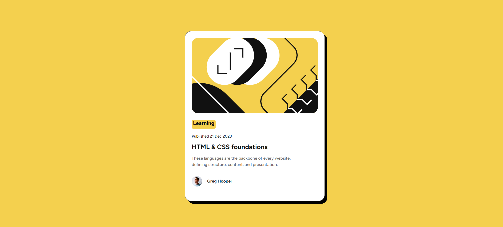
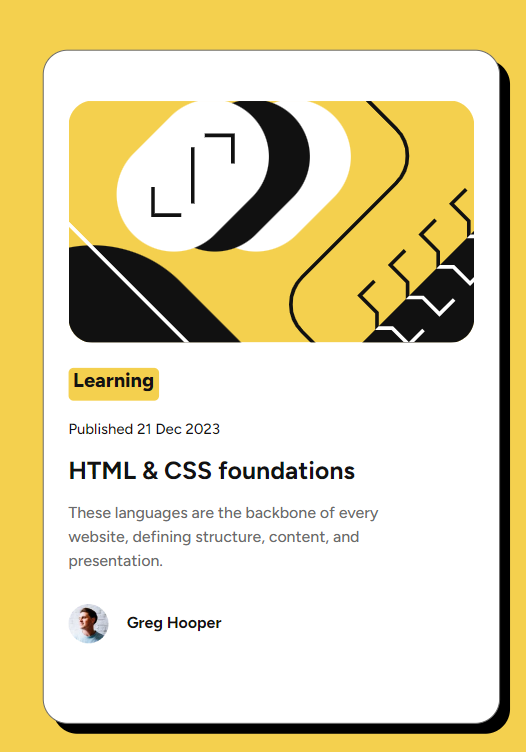

# Frontend Mentor - Blog preview card solution

This is a solution to the [Blog preview card challenge on Frontend Mentor](https://www.frontendmentor.io/challenges/blog-preview-card-ckPaj01IcS). Frontend Mentor challenges help you improve your coding skills by building realistic projects. 

## Table of contents

- [Overview](#overview)
  - [The challenge](#the-challenge)
  - [Screenshot](#screenshot)
  - [Links](#links)
- [My process](#my-process)
  - [Built with](#built-with)
  - [What I learned](#what-i-learned)
- [Author](#author)

## Overview

### The challenge

Users should be able to:

- See hover and focus states for all interactive elements on the page

### Screenshot

### Links

- Solution URL: [https://github.com/Ataize/blog-preview-card-main]
- Live Site URL: [https://ataize.github.io/blog-preview-card-main/]

## My process

### Built with

- Semantic HTML5 markup
- CSS custom properties
- Flexbox
- Mobile-first workflow
- CSS Variables
- Hover States

### What I learned

I learned how to use box-shadow to add subtle depth to elements, which enhances the design visually.

I used CSS variables for colors (--yellow, --gray-500), which helps in maintaining consistency across the design and makes it easier to change values globally.

I used some aspects of BEM (Block Element Modifier) 

## Author

- Frontend Mentor - [@yourusername]
- Linkedin - [https://www.linkedin.com/in/ataizefeitosa/]

